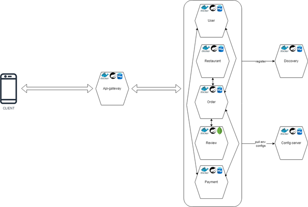

# FOOD-MICROSERVICE

# PROJE KONUSU

Proje konusu olarak online yemek sipariş uygulamasını seçtik. Bu projenin amacı, kullanıcıların mobil cihazlarını kullanarak kolayca yemek siparişi verebilmelerini sağlamaktır. Böylece kullanıcılar, restorana gitmeye gerek kalmadan yemeklerini evlerinde rahatça tüketebileceklerdir.

Projemizde kullanıcılar, e-posta adreslerini kullanarak sisteme kaydolabilir ve giriş yapabilirler. Sistemdeki restoranları ve bilgilerini görüntüleyebilir, restoranlardaki ürünleri, açıklamalarını ve değerlendirmelerini inceleyebilirler. Seçtikleri ürünü sepete ekleyip sipariş verebilirler. Sipariş verdikten sonra kart bilgilerini kullanarak ödeme yapabilir ve ödeme sonrasında siparişi değerlendirebilirler.

Bu özellikler sayesinde, kullanıcıların yemek sipariş etme deneyimini daha kolay hale getiren etkili ve kullanışlı bir proje geliştirmiş olduk. Uygulamanın kullanıcı dostu arayüzü ve pratik işlevleri, hem kullanıcıların hem de restoranların işini kolaylaştırmayı amaçlamaktadır.

# KULLANILAN KAYNAKLARIN AÇIKLANMASI

## Kullanılan projeler:

1- **Online Yemek Siparişi Projesi** https://github.com/MahiSharew/onlineFoodDelivery

- Bu proje, Java ve Spring Boot kullanılarak geliştirilmiş online bir yemek siparişi uygulamasıdır. Bizim projemize benzer şekilde müşteri yönetimi, sipariş, ödeme ve restoran gibi mikroservisleri bulunmaktadır. Bu projedeki mikroservisler arası görev dağılımını örnek aldık.

**2-  E-Ticaret Projesi**

https://github.com/nasrmohammad4804/springboot-microservice

- Bu proje de, Java ve Spring Boot kullanılarak geliştirilmiş online bir yemek siparişi uygulamasıdır. Proje içerisinde bulunan mikroservisler belirli yerlerde ayrı ayrı belirli yerlerde birlikte kullanılarak ürünleri görüntüleme, sipariş oluşturma, ödeme yapma, siparişi iptal etme, ürün sayısını azaltma gibi özellikleri sağlamaktadır. Bu projedeki mikroservisler bizim kullanacağımız servisler ve akışları hakkında fikir edinmemizi sağladı.

## İlham Alınan Mimariler:

### 1- Yemek Siparişi Uygulaması Mimarisi

Bu mimari, yukarıda bahsettiğimiz Yemek Siparişi uygulamasının mimarisidir. Bizim mimarimize çok benzer olmakla beraber, RabbitMQ gibi asenkron iletişim yöntemleri kullanılmıştır. Biz, Order ve Restaurant mikroservisleri arasında senkron iletişim kuruyoruz. Bu mimariyi temel alarak, üzerine Review gibi yeni mikroservisler ekleyerek ilerledik.

### 2- E-Ticaret Projesi Mimarisi

Bu mimari, E-ticaret projesinin mimarisidir. Geliştirdiğimiz projede kullandığımız config-server, api-gateway, discovery ve business servislerinin ilham aldığı yapı bu projedir. Bu mimari incelendikten sonra kendi mimarimizi oluşturduk.

## Kullanılan Kütüphaneler:

**Feign Client:** Projemizde mikroservisler arası iletişimi sağlamak için Feign Client kütüphanesini kullandık.

**Spring Data JPA:** Modeller ve veritabanı tabloları arasındaki bağlantıyı Spring Data JPA kullanarak kurduk.

**Spring Gateway:** Uygulamamıza gelen istekleri kabul eden ve bu istekleri diğer mikroservislere yönlendiren bir bileşendir. Ayrıca, uygulamamızdaki güvenlik filtresini yönetmek için de kullanıldı.

**Spring Cloud Netflix Eureka:** Mikroservislerin birbirlerini bulabilmeleri amacıyla kullanıldı.

**Spring Cloud Config Server:** Mikroservislerin ihtiyaç duyduğu yapılandırmaları merkezi bir mikroserviste tutmamızı sağlar.

**Lombok:** Sınıflarımız için getter, setter, constructor, builder gibi metodları otomatik olarak oluşturan yardımcı bir kütüphanedir.

**Jjwt-api:** Uygulamamızda token bazlı güvenliği sağlamak amacıyla kullanılan, Json Web Token'ların oluşturulması, imzalanması ve doğrulanması gibi işlevlere sahip bir kütüphanedir.

## Yararlanılan Yayınlar:

**1- [Caner Kaya](https://canerky96.medium.com/?source=post_page-----626cf4816a--------------------------------), Spring Cloud ve Spring Boot kullanarak Mikro Servis Projesi Hazırlamak:**

Bu yayın, bize temel seviyede bir Spring Boot mikroservis projesinin nasıl oluşturulacağını, her mikroservis projesinde bulunan mikroservislerin neler olduğunu ve bu mikroservislerin işlevlerini ele alıyor. Projenin ilk yapılanması ve ayağa kaldırılması aşamasında bu yayından yararlandık.

[https://canerky96.medium.com/spring-cloud-ve-spring-boot-kullanarak-mikro-servis-projesi-hazırlamak-626cf4816a](https://canerky96.medium.com/spring-cloud-ve-spring-boot-kullanarak-mikro-servis-projesi-haz%C4%B1rlamak-626cf4816a)

**2- Microservices Communications:**

Bu yayın, bize mikroservisler arasındaki iletişim türlerinin neler olduğunu, senkron iletişimin ve asenkron iletişimin ne anlama geldiğini ve ayrıca REST mimarisini de ele alıyor. Projemizde kullanacağımız iletişim türüne karar verirken bu yayından yararlandık.

https://medium.com/design-microservices-architecture-with-patterns/microservices-communications-f319f8d76b71

**3- Best Practices to secure microservices with spring security:**

Bu yazıda, mikroservis mimarisinde güvenliğin nasıl sağlanacağı, bunun en iyi yolları ve bazı ilgili teknolojiler ele alınıyor. Bu yazıdaki adımları takip ederek uygulamamızdaki güvenliği sağladık.

https://www.geeksforgeeks.org/best-practices-to-secure-microservices-with-spring-security/

# PROJE MİMARİSİ

## İletişim Yöntemi

Projede iletişim yöntemi olarak senkron iletişim yöntemi kullandık. Mikroservis tabanlı online yemek sipariş uygulamamızda iletişim yöntemi olarak Feign Client'ın senkron yöntemini kullanmamızın temel sebebi, ekibimizin küçük olması ve bu yöntemin sunduğu kullanım kolaylığıdır. Feign Client, RESTful web servislerine basit bir şekilde erişim sağlamamıza imkan tanıyarak, kod yazımını kolaylaştırmaktadır. Senkron iletişim, özellikle basit istek-cevap senaryolarında hız ve tutarlılık sağlar, böylece karmaşık asenkron yapıların getirebileceği zorluklardan kaçınarak, ekibin hızlı ve verimli çalışmasını sağlar.

## Mobil Çalışma Yapısı

Projede arayüz, Android arayüzü kullanılarak yapılmıştır.  Proje yapısında MVVM mimari deseni ve modüler mimari desenleri kullanılmıştır. Projemizde 2 Akış üzerinde oluşturulmuştur.

- Onboarding akışı: Kullanıcıyı karşılayan ve uygulamanın işleyişini anlatan ekranları ve kayıt veya autorize eden erkanları barındırır. Kullanıcı başarıyla giriş yaptıktan sonra ana akışa yönlendirir.
- Ana Akış: Burada uygulamanın işlevlerini gerçekleştirecek fragmentlar (iş parçacıkları) bulunur. Kullanıcı bu iş parçacıkları üzerindeki UI elemenleri ile sipariş oluşturabilir.

**Data class:** http istekleri atarken veya dönüş alırken veriyi modellemeye işe yarar. **ViewModel:** Activity veya fragmentlar kullanıcı ile etkileşimde kullanılırken viewmodellar ise iş mantığını ele almakta kullanılır.

**UseCase:** Viewmodellar ile http servisleri arasında iletişim katmanıdır. Viewmodelların oluşturmak istediği requestleri oluşturup gelen dönüşleri viewmodellara iletir.

**Viewstate:** Asinkron işlemlerin o anki durumlarını ele almaya alır. Bu işlemlerde herhangi bir değişiklik Viewstate durumu olarak döner. Örneğin başarılı http isteği viewstate.success olarak dönerken başarısız requestler viewstate.error olarak döner ve içinde gerekli veri dönüşlerini barındırır. Viewstate.loading ise diğer iki katman arasındaki ara katmandır. UI katmanı bu viewstatelere göre UI durumunu günceller.

**Hilt ile dependency yönetimi:** Uygulamamızda çeşitli sınıflar çeşitli nedenlerle birden fazla kez kullanılmaktadır. Her seferinde aynı classları oluşturulmaktansa hilt kullanılarak classlar ihtiyacı olan yapılara enjekte edilmiştir. Böylece uygulamamız daha optimize çalışacaktır.

Uygulamamızda UI kısmında recycler view denilen kaydırılabilir yapılardan faydalanır. Bunlar ürünleri listelemede ve kullanıcının sipariş oluşturmasında kullanılır. Kullanıcı bu viewlardan ekleyeceği ürünleri seçebilir. Kullanıcın sayfalar arasındaki geçişini kolaylaştırması için bottom navigation bar denilen UI elementinden faydalanır. Buradaki iconlara basarak sayfalar arasında kolayca geçiş yapabilir.

## Mikroservislerdeki (Backend) Module Yapısı

Mikroservislerdeki genel module yapıları birbirlerine benzer oldukları için bu başlık altında genel olarak module içerisinde bulunan yapılar ve genel işlevleri açıklanacaktır.

**a- Client:** Mikroservisler arasında iletişim kurmayı sağlayan Client interfacelerini barındırır.

**b- Config:** Diğer sınıfların veya framework'lerin kullandığı configuration ayarlarını içeren sınıfları bulundurur.

**c- Constants:** Mikroservis kapsamında kullanılan constant’ları veya error mesajlarını içeren sınıfları bulundurur.

**d- Controller:** REST isteklerini karşılayan, ilgili servisleri tetikleyen ve cevapları kullanıcılara gönderen controller’ları bulundurur.

**e- Dto:** Entity'lerin doğrudan kullanıcıya gönderilmemesi için dto'ları kullandık.

**f- Entity:** Veritabanında oluşturulacak tabloları map’leyen ve aralarındaki ilişkileri sağlayan entity'leri bulundurur.

**g- Error:** Hata sınıflarını içerir.

**h- Exception:** Sistemde kendi oluşturduğumuz özel exception’ları içerir.

**i- Filter:** Security’de kullanılan her istekte çalışan filter’ları içerir.

**j- Model:** İçinde Request ve Response sınıflarını bulundurur. Mobil cihazlardan gelen isteklerin body kısımları request olarak map’lenir ve gönderilecek veriler response olarak map’lenir.

**k- Populator:** Entity'ler ile Dto'lar arasındaki dönüşümü yapan populator sınıflarını bulundurur.

**l- Repository:** Veritabanına SQL sorguları göndermemizi ve cevap almamızı sağlayan interface’leri bulundurur.

**m- Service:** Business logic’in bulunduğu service sınıflarını içerir.

**n- Validation:** Custom validation sınıflarını içerir.

## Mobil Module Yapısı

Mobildeki genel module yapıları birbirlerine benzer oldukları için bu başlık altında genel olarak module içerisinde bulunan yapılar ve genel işlevleri açıklanacaktır.

**a- DTO:** UI elemanları arasında veri akışını oluşturmak için kullanılan veri yapılarıdır.

**b- Data Class:**  HTTP isteklerinde request ve response verilerini modellemek için kullanılan yapılar.

**c- Adapter:** Kaydırılabilir UI elemanlarını barındıran ve gelen veriyi bu UI elemanlarına bağlayan yapılar.

**d- ViewModel:** UI ile HTTP servisleri arasındaki arayüz katmanıdır.

**e- Repository:** Backend servislerini mobil uygulamada temsil eden yapılar.

**f- Modüller:** Uygulamamızda sıkça kullanılan metodları bulunduran yapılar.

**g- DataStore:** Uygulamada kalıcı şekilde veriyi tutmak ve istendiğinde veriyi sağlayan yapıdır. Özellikle kullanıcı tokenini tutmak için kullanılır.

**h- Navigation:** Uygulamadaki sayfa akışını belirleyen yapıdır.

## Sistemdeki Mikroservisler

Sistemde 8 adet mikroservis bulunmaktadır. Bunların ne işe yaradıklarını tek tek açıklayalım:

### 1- Api Gateway Mikroservisi:

API Gateway, gelen istekleri doğru mikroservislere yönlendirerek, güvenlik filtreleriyle birlikte isteklerin güvenliğini sağlar ve yanıtları kullanıcılara ileterek sistemdeki işlemleri yapılmasını sağlar.

### 2- Discovery Mikroservisi:

Discovery mikroservisi, mikroservislerin birbirlerini otomatik olarak bulmasını sağlar. Yeni bir mikroservis sisteme katıldığında, diğer mikroservisler onu keşfedebilir ve iletişim kurabilir, böylece sistemdeki esneklik ve ölçeklenebilirlik artar.

### 3- Config-server Mikroservisi:

Config Server, mikroservislerin ihtiyaç duyduğu confugiration ayarlarını depolayarak ve dağıtarak sistemdeki mikroservislerin kolayca yapılandırılmasını sağlar ve merkezi bir yapı oluşturmuş oluruz.

### 4- User Mikroservisi:

User mikroservisi, sistemdeki kullanıcıların yönetildiği ve güvenlik işlemlerinin gerçekleştirildiği temel bir bileşendir. Bu mikroservis, kullanıcıların kaydını tutar, kimlik doğrulama işlemlerini yönetir ve kullanıcıyla ilgili diğer güvenlik işlemlerini gerçekleştirir. Ayrıca, kullanıcıların profillerini saklar ve gerektiğinde bu bilgilere erişim izni sağlar. User mikroservisi, kullanıcıların güvenliğini sağlamak için gerekli olan tüm işlemleri merkezi bir şekilde yönetir ve diğer servislerin bu bilgilere güvenli bir şekilde erişimini sağlar. Bu sayede, sistem genelinde güvenlik sağlanır.

- **Endpoints**

- **Database Tables**

USER_CARDS

| COLUMN_NAME | DATA_TYPE |
| --- | --- |
| id | bigint |
| balance | bigint |
| card_expiry_month | varchar(255) |
| card_expiry_year | varchar(255) |
| card_number | varchar(255) |
| cvv | varchar(255) |
| user_credential_id | int |

USER_CREDENTIAL

| COLUMN_NAME | DATA_TYPE |
| --- | --- |
| id | int |
| email | varchar(255) |
| name | varchar(255) |
| password | varchar(255) |
| full_name | varchar(255) |
- **Servis Ekran Görüntüleri**

### 5- Restaurant Mikroservisi:

Restaurant mikroservisi, restoranların yönetildiği ve çeşitli kategoriler, ürünler ve taglerin ilişkilendirildiği temel bir bileşendir. Bu servis, her restoran için kategori bilgilerini saklar, ürünleri ve bu ürünlere ilişkin detayları yönetir ve ürünlere ait tagleri saklar. Restaurant mikroservisi, restoran verilerinin merkezi bir şekilde tutulmasını sağlar. Bu sayede, kullanıcılar istedikleri restoranı ve ürünleri daha kolay bulabilirler ve sistem yönetimi daha etkili hale gelir.

- **Endpoints**

- **Database Tables**

CATEGORIES

| COLUMN_NAME | DATA_TYPE |
| --- | --- |
| id | bigint |
| image | varchar(255) |
| name | varchar(255) |

PRODUCT_TAGS

| COLUMN_NAME | DATA_TYPE |
| --- | --- |
| product_id | bigint |
| tag_id | bigint |

PRODUCTS

| COLUMN_NAME | DATA_TYPE |
| --- | --- |
| id | bigint |
| product_description | varchar(255) |
| product_image | varchar(255) |
| product_name | varchar(255) |
| product_price | bigint |
| product_short_description | varchar(255) |
| stock | bigint |
| category_id | bigint |
| restaurant_id | bigint |

RESTAURANT_CATEGORIES

| COLUMN_NAME | DATA_TYPE |
| --- | --- |
| restaurant_id | bigint |
| category_id | bigint |

RESTAURANTS

| COLUMN_NAME | DATA_TYPE |
| --- | --- |
| id | bigint |
| address | varchar(255) |
| name | varchar(255) |

TAGS

| COLUMN_NAME | DATA_TYPE |
| --- | --- |
| id | bigint |
| name | varchar(255) |
- **Servis Ekran Görüntüleri**

### 6- Order Mikroservisi:

Order mikroservisi, kullanıcıların verdikleri siparişleri yöneten ve işlemlerini gerçekleştiren önemli bir bileşendir. Kullanıcıların sipariş vermesini sağlar. Ayrıca, kullanıcıların geçmiş siparişlerini izler ve gerektiğinde erişim sağlar. Order mikroservisi, sistemin genelinde siparişlerin düzenli bir şekilde işlenmesini ve yönetilmesini sağlar.

- **Endpoints**

- **Database Tables**

ORDERS

| COLUMN_NAME | DATA_TYPE |
| --- | --- |
| id | bigint |
| restaurant_id | bigint |
| total_price | bigint |
| user_id | bigint |
| is_paid | bit |

PRODUCT

| COLUMN_NAME | DATA_TYPE |
| --- | --- |
| id | bigint |
| count | bigint |
| product_id | bigint |
| order_id | bigint |
- **Servis Ekran Görüntüleri**

### 7- Payment Mikroservisi:

Payment mikroservisi, sistemdeki siparişlerin ödeme işlemlerini yöneten mikroservistir. Kullanıcıların kart bilgilerini alır, ödeme doğrulamasını yapar ve siparişin ödemesini tamamlar.

- **Endpoints**

- **Database Tables**

PAYMENTS

| COLUMN_NAME | DATA_TYPE |
| --- | --- |
| id | bigint |
| order_id | bigint |
| payment_date | datetime(6) |
| user_id | bigint |
- **Servis Ekran Görüntüleri**

### 8- Review Mikroservisi

Review mikroservisi, kullanıcıların sipariş sonrasında deneyimlerini değerlendirmelerini sağlayan ve bu değerlendirmeleri yöneten mikroservistir. Kullanıcılar, siparişe yıldız verebilirler ve yorum yapabilirler. Bu mikroservis, kullanıcı yorumlarını kaydeder, puanları hesaplar ve gerektiğinde kullanıcılarla paylaşır.

- **Endpoints**

- **Database Tables**

ORDER_REVIEW

| COLUMN_NAME | DATA_TYPE |
| --- | --- |
| id | bigint |
| order_id | int |
| review_body | varchar(255) |
| star | int |

PRODUCT_REVIEW

| COLUMN_NAME | DATA_TYPE |
| --- | --- |
| product_id | bigint |
| product_average_star | double |
| review_times_of_product | int |

REVIEW

| COLUMN_NAME | DATA_TYPE |
| --- | --- |
| id | bigint |
| order_id | int |
| review_body | varchar(255) |
| star | int |
- **Servis Ekran Görüntüleri**

- 
- 
